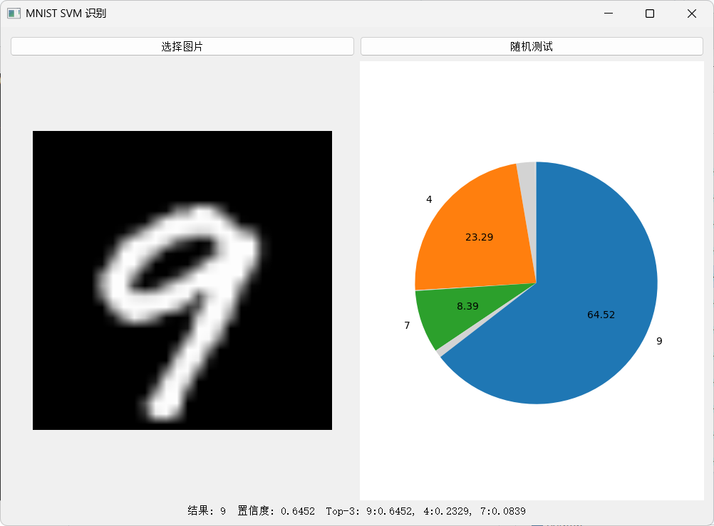
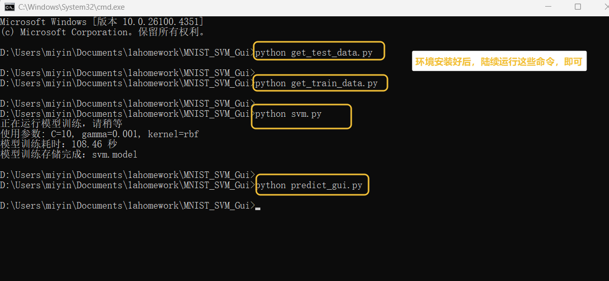

# MNIST_SVM_GUI 
# 基于SVM模型和mnist数据集的手写数字的识别系统

## 概述
- 使用 `scikit-learn` 的 SVM（RBF 核）在 MNIST 上训练分类器，并提供 PyQt5 图形界面进行图片识别。
- 训练完成后会生成模型文件 `svm.model`，GUI 支持手动选择图片与从测试集随机抽样识别。
- 识别结果以文本与饼状图展示：饼图仅突出 Top-3 置信率，其余类别统一浅灰色。

 

## 项目文件
- `img_train/train-images.idx3-ubyte`：训练集的原始二进制文件（训练图像）.
- `img_train/train-labels.idx1-ubyte`：训练集的原始二进制文件（训练标签）.
- `img_test/`：测试集的原始二进制文件（训练图像、训练标签）
- `get_train_data.py`：将 `img_train` 的 idx 文件导出为 `mnist_train` 图片集。
- `get_test_data.py`：将 `img_test` 的 idx 文件导出为 `mnist_test` 图片集。
- `svm.py`：训练脚本，读取 `mnist_train`，训练并保存 `svm.model`（打印训练耗时）。
- `predict_gui.py`：识别 GUI，支持手动选择图片与随机测试，并绘制 Top-3 饼状图。

## 快速运行
完整下载本项目。依次运行：

pip install -r requirements.txt

python get_test_data.py

python get_train_data.py

python svm.py

python predict_gui.py

  

## 环境准备
- Python 3.8+（Windows/Linux/macOS）
- 安装依赖：
  - `pip install -r requirements.txt`
  - 或`pip install numpy scikit-learn Pillow joblib PyQt5 matplotlib`
  - 若你使用虚拟环境，请先激活后再安装。

## 数据准备
- 项目已准备好原mnist数据集，亦可从 MNIST 官方下载原始二进制文件（idx 格式）并放置到如下目录：
  - 训练集：`img_train/train-images.idx3-ubyte` 与 `img_train/train-labels.idx1-ubyte`
  - 测试集：`img_test/t10k-images.idx3-ubyte` 与 `img_test/t10k-labels.idx1-ubyte`
- 运行数据转换脚本，将 idx 数据导出为图片并按类别分目录：
  - `python get_train_data.py` → 生成 `mnist_train/0-9/*.png`
  - `python get_test_data.py` → 生成 `mnist_test/0-9/*.png`
- 目录结构示例：
  - `mnist_train/0/mnist_train_123.png`
  - `mnist_test/7/mnist_test_456.png`

## 训练模型
- 运行：`python svm.py`
- 默认使用参数：`C=10`、`gamma=0.001`、`kernel='rbf'`，并采用 `ovr`（一对多）策略。
- 控制台会打印训练耗时，训练完成后保存模型到项目根目录 `svm.model`。
- 训练数据来源：`mnist_train` 目录（按 0–9 分类）。

## 图形界面
- 运行：`python predict_gui.py`
- 功能：
  - `选择图片`：从本地选择任意图片识别（会自动转灰度并缩放到 `28×28`；平均像素偏亮则自动反相；二值化到 `0/1`）。
  - `随机测试`：从 `mnist_test` 目录随机选取一张图片识别，便于快速演示。
  - 文本显示：预测类别、置信度、Top-3 概率。
  - 饼状图：仅显示 Top-3 标签与百分比；其他类别统一浅灰色且不显示文字。
- 注意：
  - 首次运行前需先训练生成 `svm.model`；否则 GUI 会提示模型不存在。
  - 若 `mnist_test` 不存在或为空，随机测试会给出提示。

## 常见问题
- `模型文件不存在: svm.model`：先运行 `python svm.py` 完成训练。
- `测试集目录不存在: mnist_test`：先运行 `python get_test_data.py` 或确认目录结构。
- 概率显示为近似值：若模型未启用 `probability=True`，GUI 会依据 `decision_function` 进行 softmax 近似；如需真实概率可将训练改为 `SVC(..., probability=True)`，但训练时间更长。

## 快速流程
- 安装依赖 → 准备 `img_train` 与 `img_test` → 运行数据转换脚本 → 训练生成 `svm.model` → 启动 GUI 进行识别与演示。
